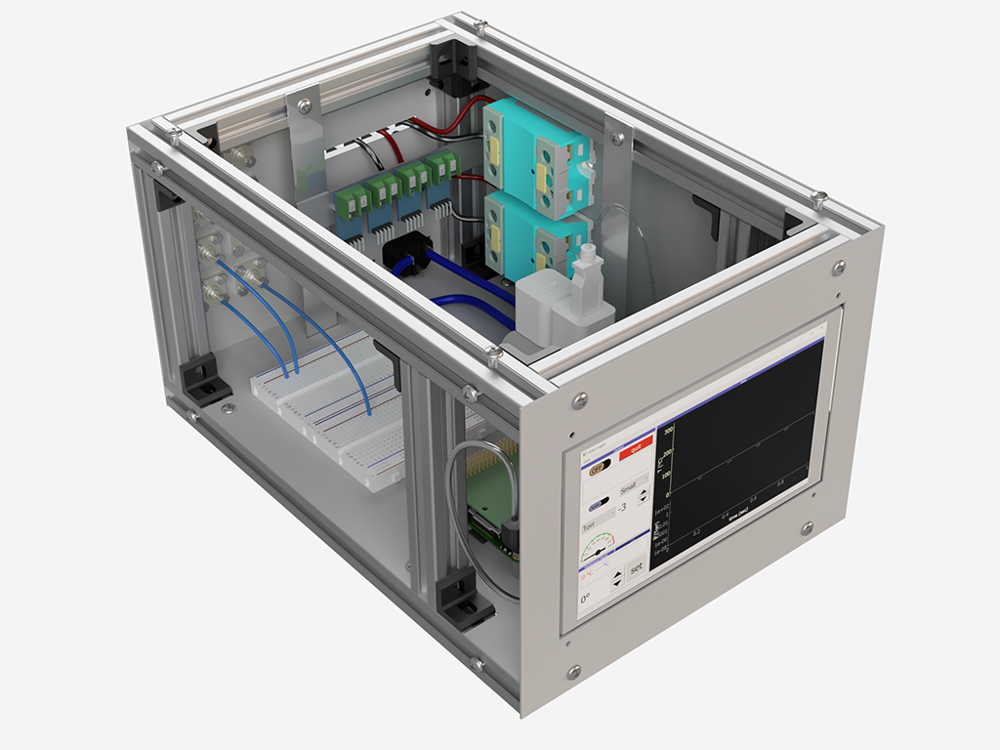

Control Unit
===============

Plasma control unit is based on a Raspberry Pi 3 with an ADC convertor and a MAX31856 thermocouple sensor.
See `ControlUnit github project <https://github.com/queezz/ControlUnit>`_.

|pic1| |pic2|

.. toctree::
    :maxdepth: 2
    :hidden:

    readloggerdata
    
